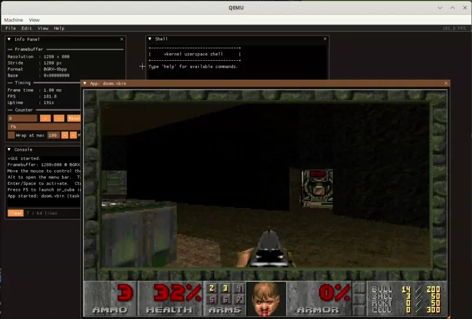
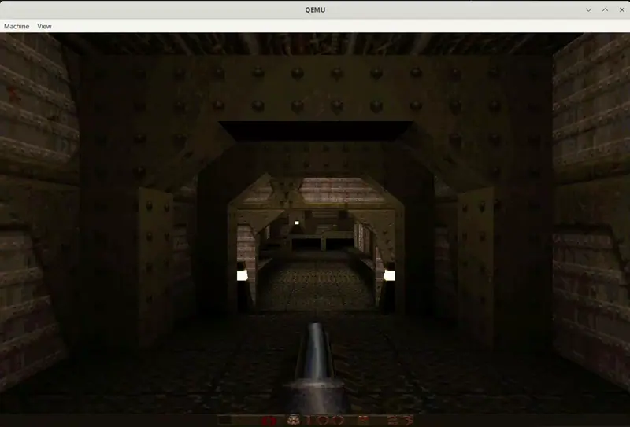

# vkernel - UEFI Hobby Kernel (C++26)

vkernel is a small x86_64 kernel and userspace playground written in
freestanding C++26. It boots directly from UEFI, mounts its boot disk through a
virtio block device, runs freestanding ELF64 `.vbin` programs, and includes a
Dear ImGui based graphical shell/window manager.

The project is intentionally experimental: userspace is still ring 0, but
processes now run with their own virtual address spaces and isolated image,
heap, and shared framebuffer mappings.

## Current Status

| Subsystem | Status |
|---|---|
| UEFI boot and self-relocation | Working |
| Serial logging and framebuffer console | Working; startup logs default to serial |
| GDT, TSS, IDT, interrupt entry/exit | Working |
| Paging hardening | Working; WP and NXE enabled |
| Kernel heap | Working; boot heap plus expandable subheaps |
| Physical page allocator | Working; free list with page release/coalescing |
| Per-process virtual address spaces | Working; image, heap, and shared framebuffer regions |
| Demand paging | Not implemented |
| Ring 3 userspace isolation | Not implemented |
| PIC, PIT, LAPIC timers | Working |
| SMP bringup | Working under QEMU with 4 CPUs |
| Preemptive round-robin scheduler | Working |
| ACPI and PCI enumeration | Working |
| Driver framework | Working |
| virtio-blk block device | Working; read/write boot disk access |
| AC97 audio | Working |
| Software mixer | Working; 8 channels |
| FAT32 runtime filesystem | Working; read, write, list, seek, remove |
| UEFI-loaded ramfs fallback | Working |
| ELF64 and PE/COFF loaders | Working |
| Kernel API (`vk_api_t`, ABI v28) | Working |
| newlib-backed userspace libc | Working |
| Keyboard, mouse, and serial input | Working |
| vGUI compositor/window manager | Working |
| KObj typed kernel object tree | Working; JSON RPC from userspace |
| Ports and demos | Doom, Quake, ClownMDEmu, MOD, MP3, raytracer, rotozoom, cube |
| IPC | Not implemented |

## Architecture

```text
┌─────────────────────────────────────────────────────────────────┐
│                 Userspace programs (.vbin ELF64)                │
│  shell  vgui  hello  doom  quake  clownmdemu  modplay  minimp3  │
│  raytracer  rotozoom  sr_cube  framebuffer demos  cppcompat     │
│                                                                 │
│  Runs in ring 0, but each process has its own CR3/address space │
├─────────────────────────────────────────────────────────────────┤
│               Userspace libc and C++ compatibility layer        │
│        crt0 · newlib syscall glue · userspace/include/vk.h      │
├─────────────────────────────────────────────────────────────────┤
│                    Kernel API (vk_api_t v28)                    │
│ console · input · memory · files · process · framebuffer · sound │
│ mixer · compositor · task snapshot · kobj JSON RPC              │
├─────────────────────────────────────────────────────────────────┤
│                         Kernel core                             │
│ scheduler · VM · heap · phys pages · FAT32 · ramfs · loaders    │
│ ACPI · PCI · drivers · sound · input · console · kobj · panic   │
├─────────────────────────────────────────────────────────────────┤
│                         Hardware layer                          │
│ GDT · IDT · TSS · paging · PIC · PIT · LAPIC · SMP trampoline   │
├─────────────────────────────────────────────────────────────────┤
│                            UEFI                                 │
│ GOP framebuffer · Simple FS boot staging · ACPI config table    │
└─────────────────────────────────────────────────────────────────┘
```

## Source Layout

```text
include/vkernel/
    vk.h                    Canonical kernel/userspace ABI
    scheduler.h             Task scheduler API
    memory.h                Kernel heap and physical allocator
    virtual_memory.h        Per-process address space API
    framebuffer.h           Shared framebuffer helpers
    fs.h                    Filesystem facade
    fs/fat32.h              FAT32 backend definitions
    fs/ramfs.h              Ramfs fallback definitions
    elf.h, pe.h             Binary loader structures
    process.h               Process launch API
    process_internal.h      Loader/task context internals
    acpi.h, pci.h           Platform discovery
    driver.h, block.h       Driver and block device interfaces
    sound.h                 Sound driver and mixer API
    input.h                 Keyboard, mouse, and serial input
    kobj.h                  Typed kernel object tree
    log.h, console.h        Logging and console output
    arch/x86_64/arch.h      x86_64 arch services

src/boot/
    efi_main.cpp            UEFI entry point and boot sequencing
    linker.ld               Kernel linker script
    reloc_stub.cpp          Empty PE relocation section

src/core/
    scheduler.cpp           Preemptive scheduler and timer dispatch
    virtual_memory.cpp      Address-space creation, mapping, teardown
    memory.cpp              Heap and physical page allocator
    process.cpp             Binary loading and task creation
    kernel_api.cpp          vk_api_t implementation
    fs.cpp                  Filesystem facade and stream handles
    elf.cpp, pe.cpp         ELF64 and PE/COFF loaders
    kobj.cpp                KObj tree and JSON RPC
    acpi.cpp, pci.cpp       ACPI and PCI support
    driver.cpp, block.cpp   Driver registry and block devices
    sound.cpp               Sound subsystem and software mixer
    input.cpp               PS/2, mouse, serial input
    console.cpp, log.cpp    Console and leveled logging
    panic.cpp               Fault reporting and halt path

src/fs/
    fat32.cpp               FAT32 read/write/list/remove backend
    ramfs.cpp               UEFI-loaded fallback file table
    uefi_loader.cpp         Pre-ExitBootServices ESP loader

src/drivers/
    virtio_blk.cpp          Legacy PCI virtio block driver
    sound_ac97.cpp          AC97 audio driver
    bochs_vbe.cpp           Bochs/QEMU display fallback probe

src/arch/x86_64/
    arch_init.cpp           GDT, IDT, TSS, paging, exception handling
    interrupts.S           256 ISR stubs and common save/restore path
    ap_trampoline.S        AP startup trampoline
    smp.cpp                 AP discovery and INIT-SIPI-SIPI bringup

userspace/
    libc/                   newlib syscall glue and CRT
    include/vk.h            libc-friendly API wrapper
    shell/                  Interactive shell
    vgui/                   Dear ImGui shell/window manager
    doom/, quake/           Game ports through vk_api_t shims
    clownmdemu/             Sega Mega Drive emulator port
    MODPlay/, minimp3/      Audio demos
    framebuffer*/           Framebuffer demos
    raytracer/, rotozoom/   Graphics demos
    sr_cube/, cppcompat/    C/C++ demos
```

## Boot Flow

1. UEFI loads `build/vkernel.efi` from `\EFI\BOOT\bootx64.efi`.
2. The kernel self-relocates because the PE `.reloc` section is intentionally
   empty and the image is linked at base 0.
3. While UEFI boot services are still available, the loader captures the memory
   map, GOP framebuffer, ACPI RSDP, and a fallback ramfs snapshot from
   `\EFI\vkernel`.
4. After `ExitBootServices`, the kernel initializes architecture state,
   logging, heap/physical memory, input, ACPI, PCI, drivers, the block layer,
   and the scheduler.
5. `virtio_blk` is loaded, the FAT32 boot filesystem is mounted, and `ac97` is
   loaded if present.
6. `shell.vbin` and `vgui.vbin` are launched, then the scheduler takes over.

## Virtual Memory

Each process gets a `vm::address_space` with its own PML4. The kernel remains
identity/direct mapped, while userspace-visible process memory is placed in
fixed high virtual regions:

| Region | Base |
|---|---:|
| Program image | `0x0000400000000000` |
| Process heap | `0x0000410000000000` |
| Shared/compositor mappings | `0x00007E0000000000` |
| User map limit | `0x0000800000000000` |

ELF images are loaded at the process image base, `vk_malloc` allocates pages
from the per-process heap region, and graphical tasks can receive a shared
framebuffer mapping owned by the compositor. This is address-space separation,
not privilege separation: code still executes in ring 0.

## Filesystem and Disk Image

The boot disk is a raw GPT image with a FAT32 EFI System Partition. At runtime,
the kernel mounts that FAT32 volume through `virtio_blk` and exposes it through
the filesystem facade:

| Operation | Status |
|---|---|
| Load file by path | Working |
| Open/read/seek/tell/close streams | Working |
| Write streams | Working on FAT32 |
| Remove files | Working on FAT32 |
| List directories | Working |
| Ramfs fallback | Read-only fallback if FAT32 is unavailable |

`scripts/make_disk.sh` stages all built `.vbin` files into `\EFI\vkernel`,
generates `vgui_apps.txt`, and copies runtime assets such as Doom WADs, Quake
PAKs, MOD/S3M files, MP3 tracks, bitmaps, and emulator ROMs when present.

## Kernel API

Every userspace binary receives a `const vk_api_t*` as its first argument.
There are no syscall instructions yet; the ABI is a function-pointer table.

| Group | Examples |
|---|---|
| Console | `vk_puts`, `vk_putc`, `vk_clear` |
| Input | `vk_getc`, `vk_try_getc`, `vk_poll_key`, `vk_poll_mouse` |
| Memory | `vk_malloc`, `vk_free`, `vk_memcpy`, `vk_memset` |
| Files | `vk_file_open`, `vk_file_read_handle`, `vk_file_write_handle`, `vk_file_seek`, `vk_file_remove` |
| Process | `vk_run`, `vk_run_auto`, `vk_run_with_fb`, `vk_run_cmdline`, `vk_wait_task`, `vk_terminate_task` |
| Tasks/time | `vk_task_snapshot`, `vk_tick_count`, `vk_ticks_per_sec` |
| Framebuffer | `vk_framebuffer_info`, `vk_set_task_framebuffer` |
| Compositor | `vk_set_compositor_active`, `vk_set_compositor_default_fb` |
| Audio | `vk_snd_play`, `vk_snd_stop`, `vk_snd_set_sample_rate`, `vk_snd_set_volume` |
| Mixer | `vk_snd_mix_play`, `vk_snd_mix_stop`, `vk_snd_mix_update` |
| KObj | `vk_kobj_rpc` with `ls`, `get`, `set`, `describe` |

`VK_API_VERSION` is currently `28`.

## vGUI

`vgui.vbin` is the graphical shell. It uses Dear ImGui and a small
`imgui_impl_vk` backend over the kernel framebuffer/compositor API.

Current panels and features:

- Launch menu populated from `vgui_apps.txt`
- Window manager for graphical `.vbin` tasks
- Per-window framebuffer routing and input routing
- Console log window
- Task Manager panel
- KObj Navigator panel
- `vkfm` file manager and file preview/launch panel
- Info/settings panels and optional ImGui demo window

The top-level build downloads Dear ImGui automatically if it is missing.

## Userspace Programs

| Binary | Description |
|---|---|
| `shell.vbin` | Interactive command shell |
| `vgui.vbin` | Dear ImGui graphical shell/window manager |
| `hello.vbin` | Runtime, file, and stdio smoke test |
| `framebuffer.vbin` | Direct framebuffer pixel demo |
| `framebuffer_text.vbin` | Text rendering into a framebuffer |
| `raytracer.vbin` | Realtime software raytracer |
| `rotozoom.vbin` | Rotate/zoom graphics effect |
| `sr_cube.vbin` | Software-rendered 3D cube |
| `modplay.vbin` | MOD/S3M tracker playback |
| `minimp3.vbin` | MP3 playback through minimp3 |
| `doom.vbin` | Chocolate Doom port |
| `quake.vbin` | Quake port |
| `clownmdemu.vbin` | Sega Mega Drive emulator |
| `cppcompat.vbin` | Small C++ runtime compatibility demo |

## Shell Commands

```text
vk> help
```

| Command | Description |
|---|---|
| `help` or `?` | List commands |
| `version` | Kernel version/build info |
| `mem` | Heap and physical allocator stats |
| `tasks` | Scheduler task list |
| `top [once]` | Live CPU usage view; `once` exits after one sample |
| `ls [path]` | List KObj path children |
| `cat <file>` | Print a text file |
| `get <path>` | Read a KObj node |
| `set <path> <value>` | Write a writable KObj node |
| `watch <path> [interval_ms]` | Poll a KObj node |
| `describe <path>` | Show KObj metadata |
| `run <program> [args...]` | Launch a userspace program |
| `drvload <name>` | Load a registered driver |
| `drvunload <name>` | Unload a driver |
| `clear` | Clear console |
| `uptime` | Show scheduler uptime |
| `reboot` | Reboot |
| `idt` | Dump interrupt descriptor table |
| `alloc` | Heap allocation smoke test |
| `panic` | Trigger a test fault |
| `exit` | Exit shell |

Entering a staged `.vbin` name directly also attempts to launch it.

## Build

### Prerequisites

```bash
# Fedora
sudo dnf install gcc-c++ make qemu-system-x86-core edk2-ovmf mtools parted

# Ubuntu / Debian
sudo apt install build-essential qemu-system-x86 ovmf mtools parted
```

The top-level Makefile currently defaults to `x86_64-redhat-linux-`.
Override it if your cross toolchain uses another prefix:

```bash
make CROSS_PREFIX=x86_64-linux-gnu-
```

### Common targets

```bash
make                  # Build build/vkernel.efi
make DEBUG=1          # Debug build
make userspace        # Build all userspace .vbin programs
make disk             # Build build/vkernel_boot.img
make disasm           # Write build/vkernel.dis
make clean            # Remove build artifacts
make distclean        # Also remove generated sysroot/newlib state
```

`make userspace` builds the libc glue and calls `scripts/setup_newlib.sh` if the
newlib sysroot is missing. The vGUI build calls `userspace/vgui/setup_imgui.sh`
if Dear ImGui has not been staged yet.

## Run

```bash
./run_qemu.sh
```

The QEMU launcher builds the disk image unless `--keep-disk` is provided. It
uses OVMF, Q35, 512 MiB RAM, 4 CPUs, SDL display, virtio VGA, virtio block,
AC97, and serial stdio.

Useful run modes:

```bash
./run_qemu.sh --debug      # Start QEMU paused with a GDB server on :1234
./run_qemu.sh --keep-disk  # Reuse build/vkernel_boot.img
```

## Debugging

```bash
make DEBUG=1 disk
./run_qemu.sh --debug
```

In another terminal:

```bash
gdb build/vkernel.efi \
  -ex 'set confirm off' \
  -ex 'set breakpoint pending on' \
  -ex 'source .vscode/find_kernel.py' \
  -ex 'target remote localhost:1234'
```

After UEFI loads the image, interrupt QEMU/GDB and run `find-kernel` to reload
symbols at the relocated runtime address.

Useful breakpoints include `vk::efi_main`, `sched::start`, `ap_init_secondary`,
`vk::panic`, `elf::load_into_address_space`, and `process::create_task`.

## Design Notes

**Position-independent PE.** The kernel is linked at base 0 and loaded by UEFI
as a PE image. Because the relocation section is intentionally empty,
`self_relocate()` patches pointer-sized values in `.data` using the load delta.

**Function-table ABI.** Userspace calls into the kernel through `vk_api_t`.
This keeps the ABI simple while the kernel is still ring 0 everywhere.

**Address-space separation without privilege separation.** Each process has a
private CR3 and fixed virtual layout. This prevents raw heap/image virtual
addresses from colliding across processes, but it is not a security boundary
until ring transitions and real syscalls exist.

**FAT32 first, ramfs fallback.** Boot services still preload files from the ESP
before `ExitBootServices`, but normal runtime file access goes through the
mounted FAT32 volume when available.

**Graphical task routing.** vGUI launches graphical apps with private backing
buffers, then asks the kernel to remap each task framebuffer into the
compositor shared region and routes keyboard/mouse events to the focused task.

**Serial-first logging.** Kernel logs start on serial output to avoid tearing
the graphical framebuffer. The log route can still be changed through KObj.

## Screenshots

### Doom



### Quake



## Compiler Requirements

- GCC 14+ with `-std=c++26`
- Clang 17+ with `-std=c++2b`
- MSVC VS 2022 17.8+ with `/std:c++latest`

Kernel freestanding flags include:

```text
-ffreestanding -nostdlib -fno-exceptions -fno-rtti -mno-red-zone
```

## License

MIT License. See `LICENSE` for details.

## References

- [OSDev Wiki](https://wiki.osdev.org/)
- [UEFI Specification](https://uefi.org/specifications)
- [Intel 64 and IA-32 Architectures Software Developer Manuals](https://www.intel.com/content/www/us/en/developer/articles/technical/intel-sdm.html)
- [Tianocore EDK II](https://github.com/tianocore/edk2)
- [Dear ImGui](https://github.com/ocornut/imgui)
- [Chocolate Doom](https://github.com/chocolate-doom/chocolate-doom)
